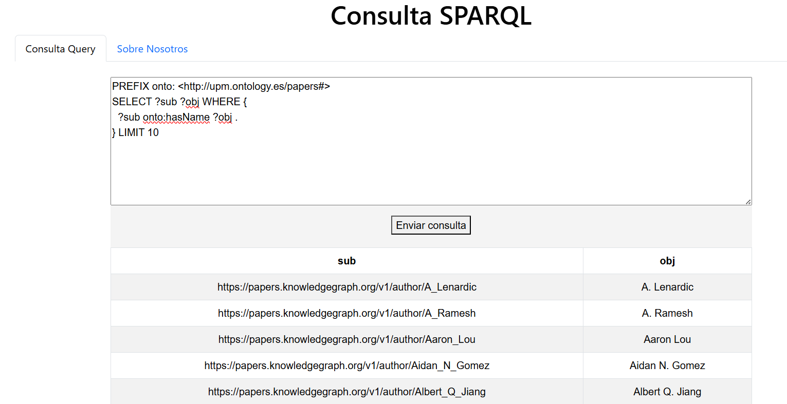

# GraphPaperSim


[](https://zenodo.org/doi/10.5281/zenodo.11237163) [](https://graphpapersim.readthedocs.io/en/latest/?badge=latest)


Advanced Data Analysis on Research Publications. Grouping of papers with the usage of a knowledge graph.

## Description
The objective of this project is a advanced Data Analysis on Research Publications. Given a corpus of 30 papers, the papers have been grouped according to their topics and similarities; and a knowledge graph has been constructed from those relationships. Additionally, the knowledge graph has been enriched with metadata using sources like [OpenAlex](https://openalex.org/) and [OpenAire](https://explore.openaire.eu/).


## Documentation
You can find the documentation [here](https://graphpapersim.readthedocs.io/en/latest/usage/)

## Requirements
To run this program you will need:
* [Docker](https://docs.docker.com/engine/install/) which is a software that provides a convenient way to package, distribute and run applications as containers, ensuring consistency across different environments.
* Operating Systems such as Windows or Linux.

## Installation instructions
**Step 1:** Clone the repository from GitHub to your local machine:

```
git clone https://github.com/RubenCid35/GraphPaperSim.git cd GraphPaperSim
```

**Step 2**: Start the docker server. In windows, you can it from the Docker Desktop o from services.

## Execution instructions
To execute the project, you only need to run the programs located in the app folder. Inside it, you will find the RDF generated in `.ttl` (`output.ttl`) format for the 30 articles.

To execute, follow these steps:

**Step 1**: Start the docker server.

**Step 2**: Go to the "app" folder.

```
cd app
```

**Step 3**: Execute the following command.

```
docker-compose up
```

The program will run at http://127.0.0.1:8050/ .


### RDF Generation
We will explain how the RDF of the 30 papers used to create the program was obtained. (Its execution is not necessary to run the previous program).

**Step 1**: First, Grobid is used to obtain information (title, abstract, acknowledgements) from the 30 papers. To do this, Grobid needs to be running:

```
docker pull lfoppiano/grobid:0.7.2
docker run -t --rm -p 8070:8070 lfoppiano/grobid:0.7.2
```

Then, the `code/grobid.py` file is executed to obtain the results in `results/results.json`.

**Step 2**: Next, topic modeling, clustering, NER, and metadata retrieval are performed using OpenAlex and OpenAire. To do this, the following programs are executed:
* `code/topic.py`  to obtain the existing topics (`results/topic.json`) and the probability of each paper to belong a topic (`results/topic_prob.json`).
* `code/similarity.py` to obtain the similarity between papers (`results/similarity_results.json`).
* `code/acknowledgment.py` for the NER model of acknowledgments (`results/acknowledgment.json`).
* `code/openalex_openaire.py` for extracting external information from papers (`results/papers_info.json`, `results/authors_info.json` y `results/institutions_info.json`)

**Step 3**: With the aforementioned JSON files, the `output.ttl` file has been obtained with [RML Mapper](https://github.com/RMLio/rmlmapper-java). This tool allows the user to execute a RML rules (that are store in the files in mappings) to generate Linked Data.  To use tool with the previous results, first the user needs to download the tool .jar from releases section and execute 
the following command: 
```bash
java -jar .\rmlmapper-6.5.1-r371-all.jar -m .\mappings\transformations.ttl -o app/output.ttl -s turtle 
```

## Running examples
In the application, there are two tabs: "Consulta-Query" (for querying the Knowledge Graph) and "Sobre Nosotros".

Below is an example of a query.

```
PREFIX onto: <http://upm.ontology.es/papers#>
SELECT ?sub ?obj WHERE {
  ?sub onto:hasName ?obj .
} LIMIT 10
```

<figure>
  
  <figcaption><i>Figure 1. Query example.</i></figcaption>
</figure>


## Preferred citation
* Yimin Zhou.
* Rubén Cid Costa.
* Rodrigo Durán Andrés.

## Where to get help
* Rubén Cid Costa: rubencid001@gmail.com
* Rodrigo Durán Andrés: rodrigo.duran.andres@alumnos.upm.es
* Yimin Zhou.: yimin.zhou@alumnos.upm.es


